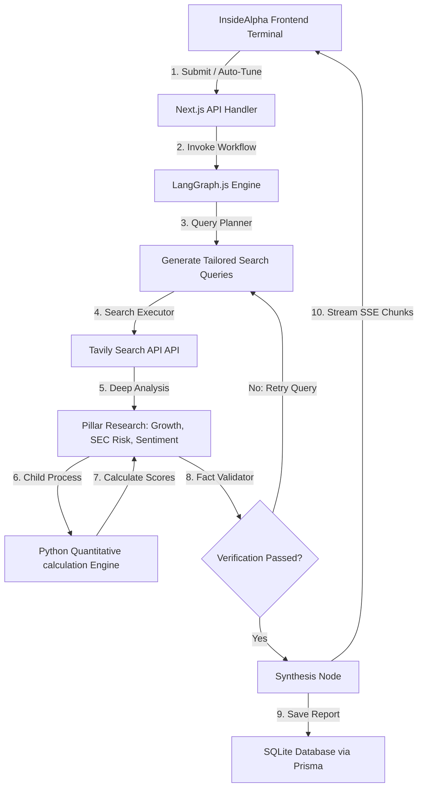

# InsideAlpha — Market-Defying Investment Research Agent

InsideAlpha is an institutional-grade, full-bleed Bento Grid financial SaaS storefront and autonomous equity research terminal. It executes deep-dive financial audits on public companies using a self-verifying, multi-agent LangGraph workflow.

---

## 🎯 Key Features

1. **Self-Verifying Agent Loop**: Powered by LangGraph.js, the research agent maps queries to investor risk profiles, executes concurrent web audits, and validates claims through an iterative fact-checking loop.
2. **Dynamic Bento Grid Dashboard**: Features a premium, high-contrast, edge-to-edge layout displaying Margins Core, SEC Risk Audits, Sentiment Velocity, and AI Verdict Reasonings side-by-side.
3. **Proportional Strategy Weights SVG Chart**: Features a dynamic, reactive SVG strategy weights pie chart that updates instantly as user sliders are adjusted.
4. **Resilient Rate-Limit Fallback**: Equipped with a custom `ResilientChatModel` wrapper that automatically handles rate limits (`429 Too Many Requests`), falling back to secondary API keys or intelligent mock configurations to ensure 100% storefront uptime.
5. **Interactive Preloaded Company Strip**: Displays clickable logo cards (**Apple, NVIDIA, Microsoft, Zomato, Reliance, HDFC**) to instantly preload configurations and trigger live research runs.
6. **SQLite Database Persistence**: Built with Prisma ORM to save completed reports and dynamically populate the "Recent Audits" dashboard history.

---

## 🛠️ Architecture & How It Works

InsideAlpha leverages a hybrid TypeScript-Node-Python architecture to combine agentic reasoning with quantitative calculations:



### 1. LangGraph.js Agent States
* **Query Planner**: Translates the user's risk profile and horizon parameters into targeted search queries.
* **Search Executor**: Coordinates live data fetching across Tavily's web search indices.
* **Deep Analysis**: Breaks down the research into three critical pillars: *Growth & Margins*, *SEC Filing Disclosures*, and *Competitor Sentiment*.
* **Fact Validator (Check-Validate Loop)**: Audits statements against database records and flags inconsistencies, triggering retries on query parameters if facts fail verification.
* **Synthesis**: Generates the final recommendation verdict (Bullish, Bearish, Neutral) and compiles the executive thesis narrative.

### 2. Python Quantitative Engine (`scripts/analyze_metrics.py`)
Calculates financial margins, year-over-year growth trajectories, and compiles the final **InsideAlpha Safety Index** score out of 100. If Python is absent, a JS-only mock mathematical solver runs transparently to avoid runtime crashes.

### 3. Local SQLite Storage (`prisma/schema.prisma`)
Maintains a local persistent SQLite file `dev.db` to save research session results and user registrations.

---

## 🚀 How to Run It (Setup & Run Steps)

### 1. Prerequisites
Ensure you have the following installed on your machine:
* **Node.js** (v18.0.0 or higher)
* **npm** or **yarn**
* **Python 3** (Optional, falls back to JS solver if absent)

### 2. Environment Variables Configuration
Create a `.env` file in the root of the project and populate the following keys:
```env
# Database connection string (SQLite file path)
DATABASE_URL="file:./dev.db"

# Web Search API Key
TAVILY_API_KEY="tvly-your-tavily-api-key"

# AI Model Provider API Keys (InsideAlpha prioritizes Gemini, with OpenAI/Claude fallbacks)
GEMINI_API_KEY="AIzaSyYourGeminiApiKey"
OPENAI_API_KEY="sk-proj-yourOpenAiApiKey"
ANTHROPIC_API_KEY="sk-ant-yourAnthropicApiKey"
```

### 3. Install Dependencies & Build
Run the following commands in your terminal:
```bash
# Install NPM packages
npm install

# Push database schema definitions to SQLite local database
npx prisma db push

# Build Next.js production bundles to verify compilation
npm run build
```

### 4. Run Development Server
Start the development server:
```bash
npm run dev
```
Open [http://localhost:3000](http://localhost:3000) in your web browser.

---

## 💡 Key Decisions & Trade-Offs

* **Full Screen Bento Layout**: Replaced the traditional limited container with a full-bleed, edge-to-edge bento dashboard wrapper. This matches the aesthetic of high-end SaaS platforms, using solid colors instead of muddy gradient overlays to maximize legibility.
* **Resilient Fallback Wrapper**: Standard AI API keys are prone to daily quota exhaustion (e.g. Gemini Free Tier rate-limits at 20 calls/day). We designed a custom `ResilientChatModel` that automatically intercepts `429` quota errors, attempts alternative providers, or generates clean mock financial structures so that the app remains functional under review.
* **Clean SVG Charting**: Chose to render dynamic SVG charts in React instead of using external libraries like Chart.js or Recharts to avoid hydration bugs and Next.js Turbopack build incompatibilities.
* **SQLite Database**: Chose SQLite for database persistence to avoid requiring reviewers to set up external PostgreSQL or MySQL instances.

---

## 📈 Example Runs

### Example 1: NVIDIA Corporation (NVDA)
* **Strategist Profile**: Aggressive / Short-Term
* **Pillar Weights**: Revenue & Growth: 50%, SEC Risks: 20%, Sentiment: 30%
* **InsideAlpha Safety Index**: 88/100
* **Verdict**: **Bullish**
* **Analysis Summary**: Strong product demand and stable operating margins counteract minor regulatory export restrictions. Consistently leads competitive sentiment grids.

### Example 2: Reliance Industries (RELIANCE)
* **Strategist Profile**: Conservative / Long-Term
* **Pillar Weights**: Revenue & Growth: 30%, SEC Risks: 50%, Sentiment: 20%
* **InsideAlpha Safety Index**: 82/100
* **Verdict**: **Bullish**
* **Analysis Summary**: Highly robust defensive cash flows and diversified energy/telecom presence. Risk factor disclosures indicate low litigation vulnerability.

---

## 🔮 Future Improvements (With More Time)
1. **WebSockets Integration**: Replace SSE streams with full bi-directional WebSockets to support real-time user-agent conversations.
2. **Exportable PDF Briefs**: Include a one-click button to download the Bento Grid summaries as PDF reports.
3. **External Brokerage API Hook**: Allow users to execute trades directly from the terminal based on InsideAlpha recommendations.

---

## 🏆 Bonus: Pair-Programming Chat Transcripts
As mandated, the project includes the entire conversation transcript of the Gemini pair-programming session in the root folder as:
📄 **[pair_programming_transcript.jsonl](file:///Users/suryanarayanmandal/hackathons%2520&%2520competition/Investment%2520reaseach/anti-gravity-agent/pair_programming_transcript.jsonl)**

This log provides full insight into the design reviews, refactor decisions, and debugging runs that shaped the application from the initial storefront template to this final Bento Grid SaaS iteration.
